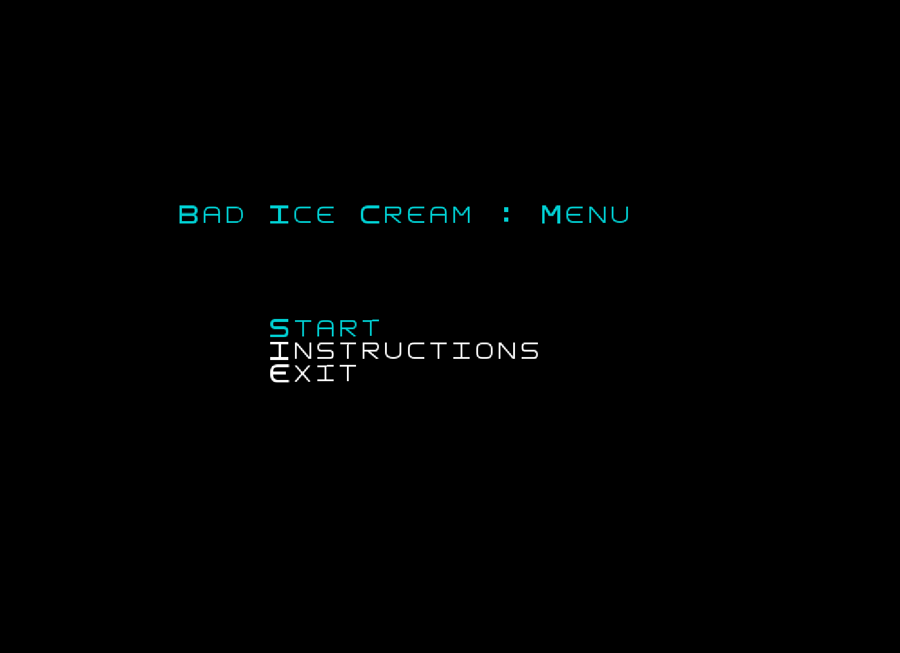
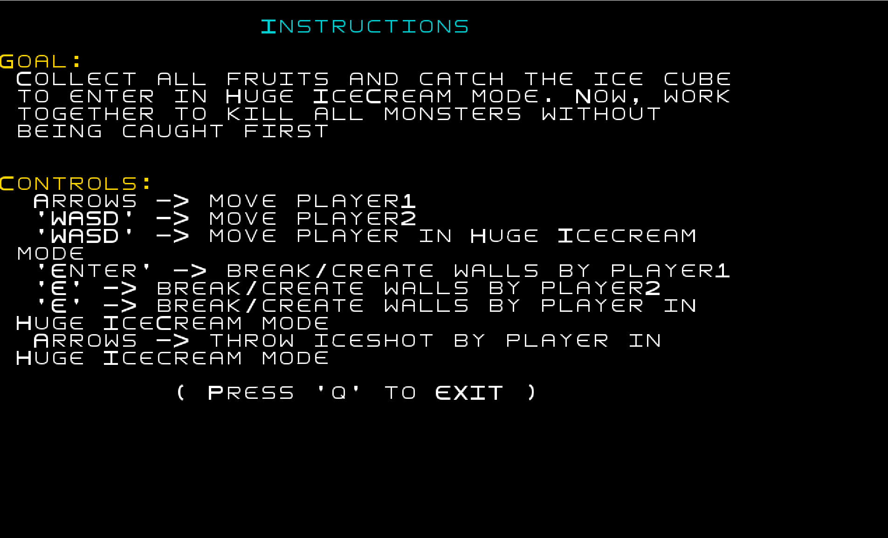
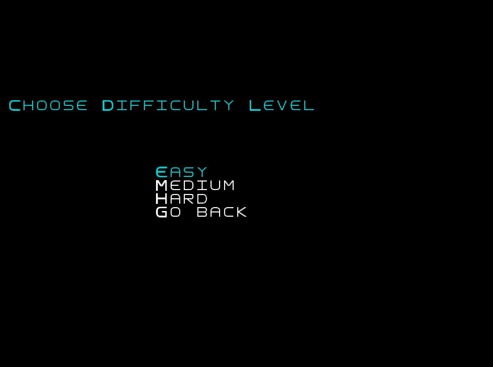
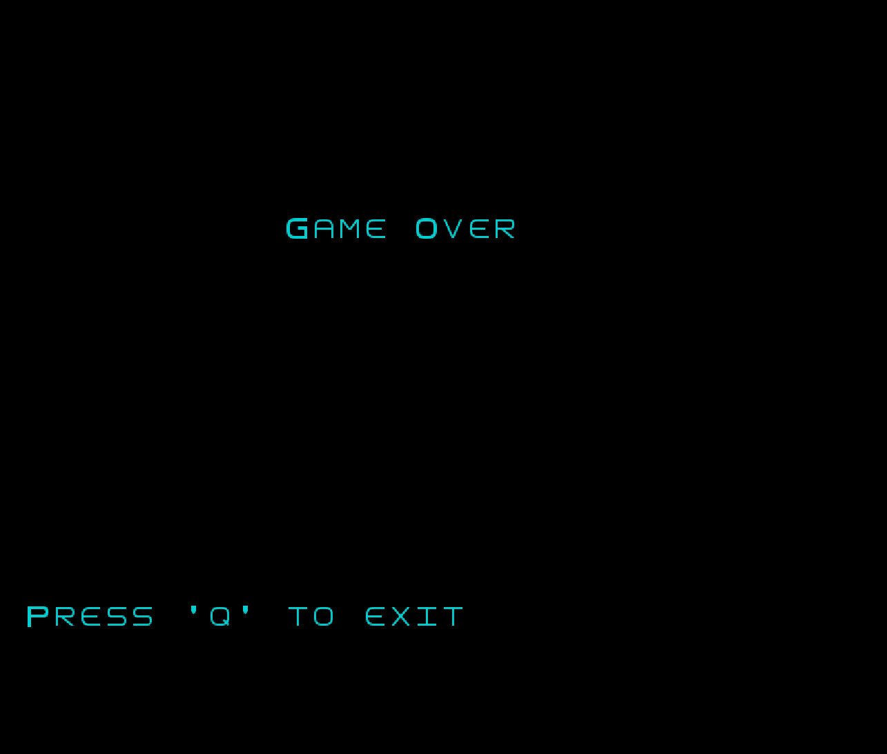
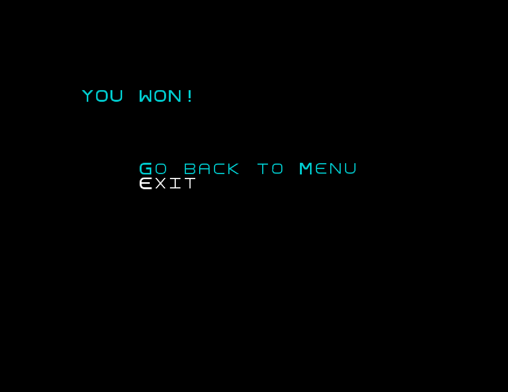
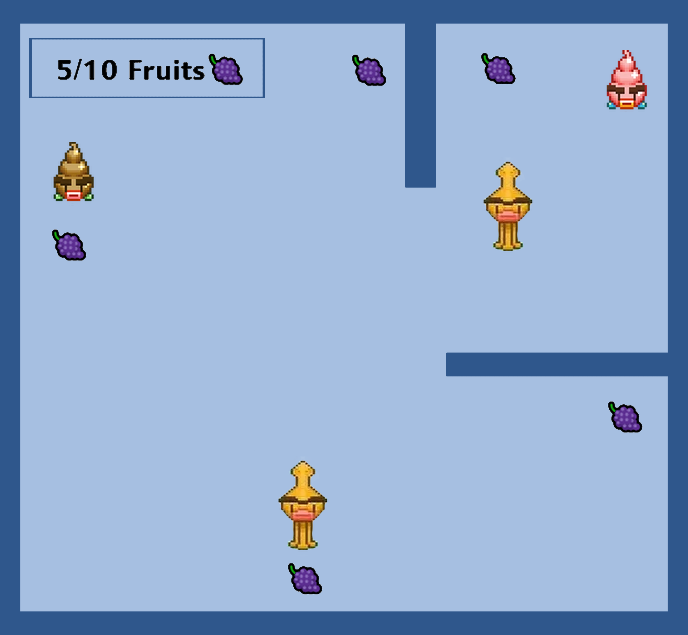

# LDTS_<04><07> - <Huge Ice Cream>

## Game Description 

Huge Ice Cream é um jogo desafiante e divertido para 2 jogadores que devem trabalhar em conjunto de modo a matar todos os inimigos e ganhar o jogo. Este jogo é baseado no famoso jogo Bad Ice Cream e é constituído por 2 etapas distintas. Na primeira etapa, os 2 jogadores devem colecionar todas as frutas sem serem apanhados pelos inimigos primeiro. Para isso, os jogadores conseguem criar e quebrar blocos de gelo. Após todas as frutas serem colecionadas, os jogadores devem apanhar o cubo de gelo que lhes permite entrar em modo "Huge Ice Cream". Nesta segunda estapa do jogo, os dois jogadores fundem-se num só em que um deles controla o seu movimento e o outro dispara cubinhos de gelo que permitem matar os todos inimigos e ganhar o jogo. Ambos os jogadores continuam a poder quebrar e criar blocos de gelo. Este jogo possui 3 níveis de dificuldade distintos.

Este projeto foi realizado por Beatriz Bernardo (up202206097@fe.up.pt), Diana Nunes (up202208247@fe.up.pt) e Marta Silva (up202208258@fe.up.pt) para LDTS 2023/2024.

Para uma descrição mais detalhada deste projeto clique [aqui](./docs/README.md).

## Screenshoots

Os screenshots seguintes ilustram uma visão geral do jogo.

## Game Menus

  

  
  <b><i>Fig 5. Main Menu </i></b>

 
 

  

  
  <b><i>Fig 5. Instructions Menu </i></b>

 
 

  

  
  <b><i>Fig 5. Difficulty Menu </i></b>

 
 

  

  
  <b><i>Fig 5. GameOver Menu </i></b>

 
 

  

  
  <b><i>Fig 5. Win Menu </i></b>

 
 

## Mockups

  

  
  <b><i>Fig 5. 2 Players State </i></b>

 
 

  

  
  <b><i>Fig 5. All fruits collected Sate </i></b>

 
 

  

  
  <b><i>Fig 5. Huge Ice Cream State </i></b>

 
 
