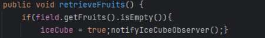
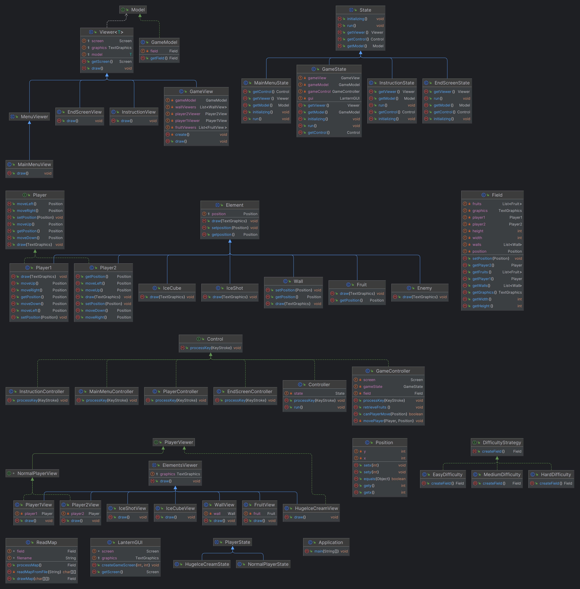

# LDTS_<04><07> - Huge Ice Cream

O nosso jogo tem o nome "Huge Ice Cream" e é baseado no conhecido e divertido jogo do friv "Bad Ice cream", porém iremos realizar diversas mudanças de modo a tornar o jogo mais complexo e desafiante. Este jogo irá ter 3 modos: "Easy", "Medium" e "Hard" para que o utilizador possa escolher o nível de dificuldade que pretende jogar. Este jogo é composto por dois jogadores que têm como objetivo matar o monstro sem que ele os apanhe primeiro. Para isso, os jogadores conseguem quebrar e criar blocos de gelo para evitar que os monstros os apanhem. Este jogo é constituído por duas etapas distintas: Primeiramente, os jogadores terão de colecionar todas as frutas(Fruits) presentes no mapa do jogo. Após completarem esta tarefa, irá aparecer no mapa um cubo de gelo (IceCube) que os jogadores devem apanhar podendo, deste modo, entrar em modo "Huge Ice Cream". Este modo faz com que os dois jogadores se fundam num só e tenham uma nova funcionalidade: atirar bloquinhos de gelo. Neste modo, um dos jogadores irá controlar o movimento da personagem Ice Cream e o outro irá controlar o disparo dos bloquinhos de gelo. O objetivo nesta fase do jogo é matarem o monstro com os bloquinhos de gelo que este novo modo "Huge Ice Cream" lhe permite disparar. Os jogadores continuam a poder quebrar e criar blocos de gelo que se possam proteger dos monstros. Assim, este é um jogo de extrema cooperação entre os dois jogadores o que torna o jogo muito mais desafiante. Como já referido, este jogo possui 3 níveis distintos de dificulddade que diferirem no número de monstros e a velocidade da movimentação dos mesmos, no número de frutas para colecionar e no design do mapa.

Este projeto foi realizado por Beatriz Bernardo (up202206097@fe.up.pt), Diana Nunes (up202208247@fe.up.pt) e Marta Silva (up202208258@fe.up.pt) para LDTS 2023/2024.

### Implemented Features

- **Chocolate IceCream** - personagem controlada pelas setas do teclado;
- **Strawberry IceCream** - personagem contralada pelas teclas "WASD" do teclado;
- **Fruits** - frutas que as personagens Chocolate IceCream e Strawberry IceCream vão apanhar para avançar no jogo. As frutas são geradas de modo diferente no mapa, tendo em conta o nível de dificuldade escolhido.
- **Monster** - monstros que se movem pelo mapa de forma aleatória e tentam apanhar as personagens ice creams;
- **Ice Cube** - bloco de gelo que os ice cream vão apanhar para entrar em modo "Huge Ice Cream";
- **Ice Shot** - quando estão em modo "Huge Ice Cream" ao clicar na tecla "espaço" o jogador irá lançar blocos de gelo usados para matar o monstro;
- **Huge Ice cream** - quando estão em modo "Huge Ice Cream" a personagem é controlada pelas teclas "WASD" ,  sendo que a direção do Throw Ice vai ser controlada pelas setas do teclado.
- **Create/Break Ice** - o player Chocolate IceCream pode criar e quebar cubos de gelo na tecla "Enter" do teclado. O jogador Strawberry IceCream pode criar e quebrar blocos de gelos na tecla "E" do teclado. No modo "Huge IceCream" o mesmo pode ser executado na tecla "Enter" do teclado.
- **Reprodução de sons** - sons distintos irão ser reproduzidos quando um evento específico acontecer. Por exemplo, quando os jogadores apanham as frutas ou quando disparam os cubinhos de gelo.

### Planned Features

Todas as features planeadas foram implementadas com sucesso.

### Design

### As Ações dos Players são diferentes dependendo do seu estado
#### **Problem in Context**:
Tivemos algumas dúvidas e dificuldades em decidir o comportamento dos players visto que os seus comportamentos mudam quando entram em modo "Huge Ice Cream". Neste modo os dois players fundem-se apenas num e têm funcionalidades diferentes, nomeadamente atirar cubos de gelo que permitem matar o monstro. Isto é uma violação do "Single Responsibility Principle" (SRP). Uma solução para este problema seria colocar toda esta lógica no mesmo método mas continuaríamos a não cumprir o SRP.

#### The Pattern:
Para contornar este problema decidimos aplicar o State Pattern. Este pattern permite-nos representar os dois estados do jogo em subclasses distintas. De facto, vamos poder mudar para o estado "Huge Ice Cream" do jogo apenas mudando para outra implementação. Assim, vamos conseguir solucionar o problema, uma vez que utilizando o state pattern vamos conseguir controlar o comportamento dos jogadores de forma mais eficiente.

#### Implementation:
As classes podem ser encontradas nos ficheiros seguintes:
- [Player1] (https://github.com/FEUP-LDTS-2023/project-l04gr07/blob/c1b38505419adf164a52ed3fa3533fe7b3a724e5/src/main/java/l04gr07/model/Game/FieldElements/Player1.java)
- [Player2] (https://github.com/FEUP-LDTS-2023/project-l04gr07/blob/c1b38505419adf164a52ed3fa3533fe7b3a724e5/src/main/java/l04gr07/model/Game/FieldElements/Player2.java)
- [HugeIceCreamState] (https://github.com/FEUP-LDTS-2023/project-l04gr07/blob/c1b38505419adf164a52ed3fa3533fe7b3a724e5/src/main/java/l04gr07/model/Game/FieldElements/PlayerState/HugeIceCreamState.java)
- [NormalPlayerState] (https://github.com/FEUP-LDTS-2023/project-l04gr07/blob/c1b38505419adf164a52ed3fa3533fe7b3a724e5/src/main/java/l04gr07/model/Game/FieldElements/PlayerState/NormalPlayerState.java)
- [PlayerState] (https://github.com/FEUP-LDTS-2023/project-l04gr07/blob/c1b38505419adf164a52ed3fa3533fe7b3a724e5/src/main/java/l04gr07/model/Game/FieldElements/PlayerState/PlayerState.java)

  

  <b><i>Fig 1. State Pattern Pattern UML Diagram</i></b>

#### Consequences:
A implementação deste pattern trouxe-nos alguns benefícios, nomeadamente os estados que temos no nosso jogo ficaram explícitos no nosso código, tornando mais fácil de manusear e entender. A possível adição de um novo estado torna-se mais fácil, não afetando as classes que já existem. Este pattern leva ao aumento do número de classes, no entanto, é possível serem bem gerenciadas visto que não é um número muito grande.

### Ice Cube só aparece na Arena quando todas as Frutas são coletadas
#### Problem in Context:
Deparamo-nos também com alguns desafios no que toca à implementação da lógica em que o IceCube é notificado quando todas as frutas são colecionadas pelos jogadores podendo, deste modo, aparecer no jogo. Este problema poderia ser solucionado definindo um mesmo método com diferentes implementações e argumentos (ad-hoc polymorphism), mas iria levar a um código muito mais desorganizado e difícil de manter e poderíamos não estar a cumprir o "Single Responsibility Principle" (SRP), pois iríamos estar a misturar a lógica de notificação com outras partes do código.

#### The Pattern:
Decidimos então que a aplicação do design pattern Observer seria uma melhor solução para este problema. Assim, o IceCube será um "observer" que aguarda notificação de quando todas as frutas forem colecionadas, ficando assim separadas as lógicas de coleção de frutas e notificação do IceCube.

#### Implementation:
As classes podem ser encontradas nos ficheiros seguintes:
- [GameController] (https://github.com/FEUP-LDTS-2023/project-l04gr07/blob/97dd4ae384a51db7059f11748a7bcd76079d32bc/src/main/java/l04gr07/control/GameController.java)
- [Interface IceCubeObserver] (https://github.com/FEUP-LDTS-2023/project-l04gr07/blob/97dd4ae384a51db7059f11748a7bcd76079d32bc/src/main/java/l04gr07/control/IceCubeObserver.java)

  

  <b><i>Fig 2. Notify Ice Cube</i></b>

  

  <b><i>Fig 3. Spawn Ice Cube</i></b>

#### Consequences:
A aplicação deste pattern traz vários benefícios nomeadamente, separar a lógica de coletar frutas da lógica de notificar IceCube tornando o código mais eficiente e fácil de ler. A possível adição de novos observers torna-se também mais fácil. Porém, a aplicação deste padrão leva-nos a ter de ter um maior cuidado a gerenciar corretamente os observers, evitando notificações desnecessárias, o que não é díficil visto que o IceCube só será notificado uma vez.

### Diferentes sons são reproduzidos com base nas ações dos jogadores
#### Problem in Context:
O nosso jogo requer a reprodução de sons em vários momentos distintos, por exemplo quando os jogadores apanham frutas, apanham o IceCub, disparam, etc. Tal como no problema anterior poderíamos implementar esta lógica de forma ad-hoc, ou seja, ao definir um mesmo método, mas com diferentes implementações e parâmetros. Porém, como já referido anteriormente isto iria levar a violações do Single Responsibility Pattern e tornava o código desorganizado e difícil de manter.

#### The Pattern:
Para resolver esta situação recorremos ao Singleton Pattern. Este pattern garante que uma classe, neste caso AudioController, tenha apenas uma instância e fornece um ponto de acesso global a essa instância. Para além, o estado do som será sempre compartilhado e é o ponto de controlo para todas as operações relacionadas ao som.

#### Implementation:
As implementações podem ser encontradas nas seguintes classes:

- [AudioController] (https://github.com/FEUP-LDTS-2023/project-l04gr07/blob/97dd4ae384a51db7059f11748a7bcd76079d32bc/src/main/java/l04gr07/control/AudioController.java)
- [AudioPlayer] (https://github.com/FEUP-LDTS-2023/project-l04gr07/blob/97dd4ae384a51db7059f11748a7bcd76079d32bc/src/main/java/l04gr07/control/AudioPlayer.java)
- [GameController] (https://github.com/FEUP-LDTS-2023/project-l04gr07/blob/97dd4ae384a51db7059f11748a7bcd76079d32bc/src/main/java/l04gr07/control/GameController.java)
- [PlayerController] (https://github.com/FEUP-LDTS-2023/project-l04gr07/blob/97dd4ae384a51db7059f11748a7bcd76079d32bc/src/main/java/l04gr07/control/PlayerController.java)

#### Consequences:
Este pattern traz-nos vários benefícios tais como ter apenas um ponto de acesso a toda a lógica relacionada com o som que pode ser acedida de qualquer parte do código o que evita duplicações de código. Para além disso, torna-se mais simples adicionar novos métodos relacionados com o som e testar uma única instância controlada é mais simples e eficaz do que várias independentes.

### ORGANIZAÇÃO CÓDIGO
#### Problem in Context:
Deparamo-nos com alguns problemas a respeito da organização arquitetural do nosso código. Tivemos a necessidade de realizar separação de responsabilidades em componentes principais de modo a facilita a manutenção e leitura do nosso código.

#### The Pattern:
Para isso utilizamos o architectural pattern Model-View-Controller(MVC). Este pattern permite dividir o código do jogo em 3 componentes principais cada uma com a sua responsabilidade específica. Assim, "Model" lida com a lógica do jogo e representa os dados, "Viewer" gere a forma como os dados presentes em "Model" vão ser mostrados, ou seja, a representação gráfica do jogo e envia as ações do usuário para "Controller" que irá gerenciar e interpretar estas ações. Deste modo, ao dividir o código nestas partes, conseguimos contornar o nosso problema, visto que se torna mais fácil de fazer mudanças e atualizações no jogo sem afetar outras partes do sistema. Para além disso, facilita também a criação de testes unitários para cada uma das componentes e facilita também a nossa colaboração em equipa visto que cada parte tem a sua responsabilidade específica.

#### Implementation:
As implementação pode ser encontradas nos ficheiros dos diretórios seguintes:
- model (https://github.com/FEUP-LDTS-2023/project-l04gr07/tree/c1b38505419adf164a52ed3fa3533fe7b3a724e5/src/main/java/l04gr07/model)
- view (https://github.com/FEUP-LDTS-2023/project-l04gr07/tree/c1b38505419adf164a52ed3fa3533fe7b3a724e5/src/main/java/l04gr07/view)
- control (https://github.com/FEUP-LDTS-2023/project-l04gr07/tree/c1b38505419adf164a52ed3fa3533fe7b3a724e5/src/main/java/l04gr07/control)

  

  <b><i>Fig 4. Model, Controller and Viewer pattern design</i></b>

#### Consequences:
De modo geral este architectural pattern trouxe-nos vários benefícios, uma vez que nos permite ter uma estrutura mais organizada, facilitando o desenvolvimento do projeto. Para além disso, como realizamos muitas mudanças e atualizações no jogo este pattern é também umas mais valia.

A figura que representa o diagrama UML está presente no ficheiro e na figura seguinte:
https://github.com/FEUP-LDTS-2023/project-l04gr07/blob/de1047b29a661b3ef1659d33c4613df84d97ed51/docs/UML.png

  

## Known Code Smells

#### **Long Switch States**

Na classe PlayerController o método processKey apresenta uma série de cases no método switch. De facto, ao ter dois jogadores tivemos a necessidade de criar comandos diferentes na movimentação de cada um deles o que levou a que este método implementasse uma estrutura "switch" muito longa. Porém achamos justificável manter este método assim, uma vez que não foi necessário estendê-lo e por ser um jogo para dois jogadores necessitamos deste método.

#### **Large Class**

A class ReadMap pode ser um code smell de uma large class por ter diversas responsabilidades. De facto, esta classe vai ler o mapa de um ficheiro e criar todos os elementos do mapa desde paredes, frutas e monstros o que faz com que esta classe fica mais extensa e com diversos métodos. Como esta classe não interfere com mais nenhuma lógica do jogo, apenas a criação inicial de cada nível, consideramos deixa-la assim.

#### **Lazy Classes**

FruitView, IceCubeView e IceShotView são classes que não fazem muito e irão implementar métodos semelhantes. Porém, achamos justificável manter estas classes visto que cada uma delas representa um elemento diferente do jogo e cada uma delas tem a sua responsabilidade específica.

## Testing

https://github.com/FEUP-LDTS-2023/project-l04gr07/blob/c1b38505419adf164a52ed3fa3533fe7b3a724e5/docs/TestCoverage.png

  

### Link to mutation testing report

### Auto-avaliação

Beatriz Bernardo: 33%
Diana Nunes: 33%
Marta Silva: 33%